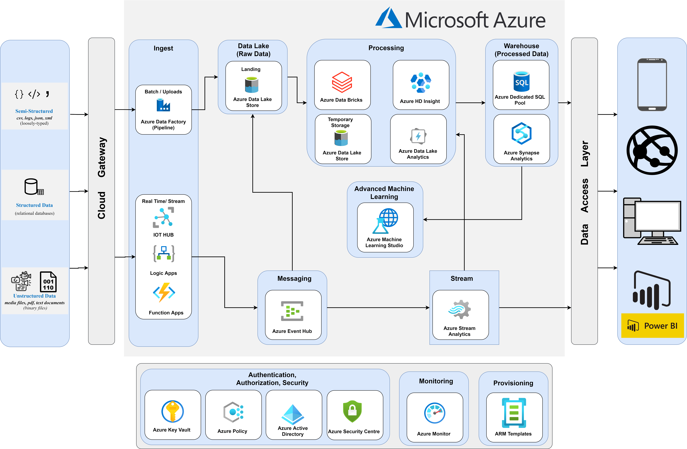

<h1 align="center">
    
  Azure Data Lake
</h1>

This is a <b>Big Data</b> pipeline desinged for <b>Azure Data Lake</b>

 

## 
⚡️ How it Works

 

Coming Soon.

 

## 
 📄 Details

### 🛠 Services Used

  

###### `Data Ingestion`

|                                                        |        Service       |                  Description                                                                                                                                                                                                           |
| ------------------------------------------------------ | -------------------- | -------------------------------------------------------------------------------------------------------------------------------------------------------------------------------------------------------------------------------------- |
|     | `Azure Data Factory` |  [Azure Data Factory](https://docs.microsoft.com/en-us/azure/data-factory/) is Azure's cloud ETL service for scale-out serverless data integration and data transformation.                                                            |
|          |       `IOT Hub`      |  [Azure IOT Hub](https://azure.microsoft.com/en-us/services/iot-hub/) is Microsoft's Internet of Things connector to the cloud.                                                                                                        |
|       |     `Logic Apps`     |  [Azure Logic Apps](https://docs.microsoft.com/en-us/azure/logic-apps/logic-apps-overview) is a cloud-based platform for creating and running automated workflows that integrate your apps, data, services, and systems                |
|    |   `Function Apps`    |  [Azure Functions](https://docs.microsoft.com/en-us/azure/azure-functions/functions-overview) is a serverless compute service that lets you run event-triggered code without having to explicitly provision or manage infrastructure.  |

 

###### `Data Lake (Raw Data)`

|                                                                |          Service        |                  Description                                                                                                                                                                                       |
| -------------------------------------------------------------- | ----------------------- | ------------------------------------------------------------------------------------------------------------------------------------------------------------------------------------------------------------------ |
|     | `Azure Data Lake Store` |  [Azure Data Lake Storage](https://azure.microsoft.com/en-us/services/storage/data-lake-storage/#documentation) is a secure cloud platform that provides scalable, cost-effective storage for big data analytics.  |

 

###### `Processing`

|                                                                |          Service            |                  Description                                                                                                                                                                      |
| -------------------------------------------------------------- | --------------------------- | ------------------------------------------------------------------------------------------------------------------------------------------------------------------------------------------------- |
|     | `Azure DataBricks`          |  [Azure Databricks](https://docs.microsoft.com/en-us/azure/databricks/scenarios/what-is-azure-databricks) is a data analytics platform optimized for the Microsoft Azure cloud services platform. |
|      | `Azure HD Insight`          |  [Azure HDInsight](https://docs.microsoft.com/en-us/azure/hdinsight/hdinsight-overview) is a managed, full-spectrum, open-source analytics service in the cloud for enterprises.                  |
|                                                                | `Azure Data Lake Analytics` |  [Azure Data Lake Analytics](https://docs.microsoft.com/en-us/azure/data-lake-analytics/) allows you to run big data analysis jobs that scale to massive data sets.                               |
             
 

###### `Data Warehouse (Processed Data)`

|                                                                |          Service              |                  Description                        |
| -------------------------------------------------------------- | ----------------------------- | --------------------------------------------------- |
|        | `Azure Dedicated SQL Pool`    |                  [Azure Dedicated SQL pool](https://docs.microsoft.com/en-us/azure/synapse-analytics/sql-data-warehouse/sql-data-warehouse-overview-what-is) (formerly SQL DW) refers to the enterprise data warehousing features that are available in Azure Synapse    |
|  | `Azure Synapse Analytics`     |                  [Azure Synapse Analytics](https://docs.microsoft.com/en-us/azure/synapse-analytics/sql-data-warehouse/sql-data-warehouse-overview-what-is) is an analytics service that brings together enterprise data warehousing and Big Data analytics.             |

 

###### `Advanced Machine Learning`

|                                                                   |          Service                |                  Description                        |
| ----------------------------------------------------------------- | ------------------------------- | --------------------------------------------------- |
|     | `Azure Machine Learning Studio` |     [Azure Machine Learning Studio](https://docs.microsoft.com/en-us/azure/machine-learning/overview-what-is-machine-learning-studio) is a GUI-based integrated development environment for constructing and operationalizing Machine Learning workflow on Azure.  |

 

###### `Messaging`

|                                                        |        Service       |                  Description                        |
| ------------------------------------------------------ | -------------------- | --------------------------------------------------- |
|       | `Azure Event Hub`    |   [Azure Event Hub](https://docs.microsoft.com/en-us/azure/event-hubs/event-hubs-about) is a big data streaming platform and event ingestion service. It can receive and process millions of events per second.    |

 

###### `Streaming`

|                                                               |        Service           |                  Description                        |
| ------------------------------------------------------------- | ------------------------ | --------------------------------------------------- |
|   | `Azure Stream Analytics` |    [Azure Stream](https://docs.microsoft.com/en-us/azure/stream-analytics/stream-analytics-introduction) Analytics is a real-time analytics and complex event-processing engine that is designed to analyze and process high volumes of fast streaming data from multiple sources simultaneously.   |

 

###### `Authentication, Authorization & Security`

|                                                                 |        Service           |                  Description                        |
| --------------------------------------------------------------- | ------------------------ | --------------------------------------------------- |
|                | `Azure Key Vault`        |    [Azure Key Vault](https://docs.microsoft.com/en-us/azure/key-vault/general/basic-concepts) is a cloud service for securely storing and accessing secrets.   |
|                    | `Azure Policy`           |    [Azure Policy](https://docs.microsoft.com/en-us/azure/governance/policy/overview) helps to enforce organizational standards and to assess compliance at-scale.   |
|    | `Azure Active Directory` |    [Azure Active](https://docs.microsoft.com/en-us/azure/active-directory/fundamentals/active-directory-whatis) Directory (Azure AD) is Microsoft’s cloud-based identity and access management service, which helps your employees sign in and access resources.   |
|           | `Microsoft Defender for Cloud`  |    [Microsoft Defender for Cloud](https://docs.microsoft.com/en-us/azure/defender-for-cloud/defender-for-cloud-introduction) is a tool for security posture management and threat protection.   |

 

###### `Monitoring`

|                                                               |        Service           |                  Description                        |
| ------------------------------------------------------------- | ------------------------ | --------------------------------------------------- |
|       | `Azure Monitor`          |                  WordPress URL                      |

 

###### `Provisioning`

|                                                               |        Service                     |                  Description                        |
| ------------------------------------------------------------- | ---------------------------------- | --------------------------------------------------- |
|         | `Azure Resource Manager Templates` |                  WordPress URL                      |

 

### 💽 Accepted Data Input Types 

 

###### `Data Input Types`

|                                                               |        Service                     |                  Description                        |
| ------------------------------------------------------------- | ---------------------------------- | --------------------------------------------------- |
|         |         `Structured Data`          |                  WordPress URL                      |
|         |       `Semi-Structured Data`       |                  WordPress URL                      |
|         |         `Unstructured Data`        |                  WordPress URL                      |

 

### 🔍 Supported Analysis Types

 

###### `Analysis Types`

|                                                               |        Service                     |                  Description                        |
| ------------------------------------------------------------- | ---------------------------------- | --------------------------------------------------- |
|         |         `Azure HDInsight`          |                  With HDInsight, you can use open-source frameworks such as Hadoop, Apache Spark, Apache Hive, LLAP, Apache Kafka, Apache Storm, R, and more, in your Azure environment.                      |
|         |       `Semi-Structured Data`       |                  WordPress URL                      |

 

### 🏗 Implementation / Provisioning

 

###### `IAC`

|                                                               |        Service                      |                  Description                        |
| ------------------------------------------------------------- | ----------------------------------- | --------------------------------------------------- |
|         |  `Azure Resource Manager Templates` |                  WordPress URL                      |
|         |              `Terraform`            |                  WordPress URL                      |

 

### 🔗 Networking Services Used

 

###### `Networking`

|                                                               |        Service                      |                  Description                        |
| ------------------------------------------------------------- | ----------------------------------- | --------------------------------------------------- |
|         |  `Azure VPC`                        |                  WordPress URL                      |
|         |              `Azure DNS`            |                  WordPress URL                      |

## 
✌️ Info

 
Created by [Brave Okafor](https://github.com/braveokafor) for [Tynes.science](https://tynes.science/).

